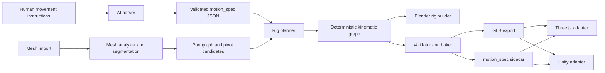
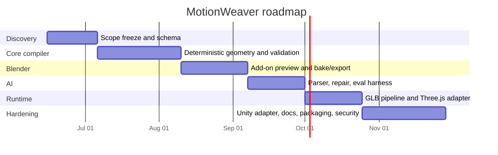

# MotionWeaver

## Executive summary

MotionWeaver is feasible **if it is defined correctly**. The buildable product is **not** “general AI rigging for anything in Blender.” The buildable product is an **AI-assisted motion compiler** for **rigid multipart mechanical assets** that converts human-written movement intent into a validated `motion_spec` and then compiles that spec into deterministic Blender rigs, preview controls, and exportable runtime data. That scope fits both the current commercial gap and the underlying technical substrate of Blender and glTF much better than a general-purpose auto-rigger for arbitrary deformable meshes. glTF natively supports node transform animation through translation, rotation, and scale channels, and that is exactly what doors, hatches, turrets, antennas, and robot joints usually need. Blender also supports add-ons, custom properties, and drivers, which makes a compiler-style workflow practical. citeturn19view0turn20view2turn20view4turn0search0turn0search6turn1search9

The strongest evidence for the opportunity is the mismatch between what exists and what you want. Commercial tools such as Mixamo and AccuRIG are still centered on **characters**; Autodesk Flow Studio’s AI rigging is also framed around **characters** generated from text or images; Anything World’s Animate Anything is the closest commercial cousin, but it is a cloud-first auto-rig/auto-animation product rather than a **spec-first, validated, deterministic compiler** that turns user-authored motion intent into a portable motion contract. In parallel, recent research such as RigAnything, UniRig, Anymate, Puppeteer, AniGen, and Rigel3D shows that arbitrary-shape rigging is advancing quickly, but those systems are still predominantly research pipelines focused on skeletons/skinning and are not an immediate substitute for a production-grade mechanical motion compiler. AniGen explicitly notes that post-hoc rigging methods often depend heavily on the distribution of the input mesh and struggle with topology, shape, and pose variance common in generative outputs. citeturn0search19turn1search2turn1search17turn30view2turn30view3turn30view4turn29view1turn29view2turn29view3turn28view5turn28view1turn28view2

The correct initial architecture is therefore **spec-first and compiler-first**. The AI should parse intent and propose structure; the deterministic system should own mesh analysis, pivot placement, kinematic graph construction, validation, export baking, and runtime adaptation. This is also the safest way to avoid the common “AI sucks with Blender” failure mode: do **not** let the model freehand `bpy` code as the primary authoring path. Instead, make the model emit **schema-constrained JSON**, then have deterministic code interpret it. OpenAI, Anthropic, and Google all now expose structured output / tool-use capabilities that are appropriate for this kind of compiler front end. citeturn31view1turn31view2turn35view0turn31view3

If key choices remain unspecified, the best defaults are clear. **Blender version** is unspecified; the recommended baseline is **Blender 4.5 LTS** because it is the active long-term-support release of the 4.x line, with support through July 2027, while Blender 5.1 is the current general release and should be covered by smoke tests. **Provider choice** is unspecified; the recommended parser default is **Claude Sonnet 4.6** for long-context coding-oriented work, with **GPT-4.1** and **GPT-4.1 mini** as very strong structured-output alternatives and **Gemini 2.5 Pro** as a high-capability reasoning alternative. **Runtime target** is unspecified; the recommended default is **GLB/glTF output plus a Three.js adapter first, Unity second**. citeturn4search3turn4search12turn31view6turn13view1turn32view0turn32view1turn31view5turn19view1turn19view2

The bottom-line recommendation is straightforward: **build MotionWeaver as a motion-spec compiler for rigid mechanical multipart assets, not as a general auto-rigger**. That product can plausibly ship, validate itself, and interoperate across Blender, web runtimes, and game engines with far less magic and far more reliability than a raw “AI does Blender” approach. citeturn19view0turn20view2turn20view4turn30view2turn30view3turn28view1

## Market and research landscape

The commercial market is crowded around **humanoid character auto-rigging** and, increasingly, **cloud animation services**. It is not crowded around **user-authored motion intent compiled into validated, deterministic, mechanical rigs**. That is the opening.

| Tool | What it demonstrably does | Where it falls short for MotionWeaver | Why it matters |
|---|---|---|---|
| Mixamo | Adobe’s Mixamo is built around uploading a **custom 3D character**, auto-rigging it, and applying animations. citeturn0search19 | Character-centric. It is not a mechanical joint compiler, and it does not expose a validated motion contract for arbitrary doors, hatches, turrets, or antennas. | Confirms that mass-market demand has historically been character-first. |
| AccuRIG | Reallusion describes AccuRIG as a **free auto-rigging solution for 3D characters**, with exports aimed at major 3D tools and game engines. citeturn1search2turn1search17 | Same core limitation: character skeleton workflow rather than rigid-part kinematics and instruction-to-spec compilation. | Good proof that “easy rigging” sells, but not in your actual target segment. |
| Autodesk Flow Studio | Autodesk positions Flow Studio as a **cloud-based AI-powered 3D toolset**; its “3D generation & AI rigging” feature auto-rigs **3D characters** generated from text or images, and exports via USD. citeturn30view2 | Strong for cinematic character workflows, weak match for deterministic rigid mechanical assemblies and local Blender-first compilation. | Important signal that “AI rigging” is becoming a product category, but still mostly character/media focused. |
| Animate Anything | Anything World / Everything Universe says Animate Anything can auto-rig and animate models in browser, Blender, Unreal, and other environments; its Blender add-on emphasizes automatic rigging and cloud AI processing. citeturn30view3turn30view4 | The closest adjacent product, but still primarily an **auto-rig/auto-animation service** rather than a **spec-first compiler** with deterministic validation and portable runtime contracts. | This is the most relevant commercial benchmark and the clearest sign the category exists. |
| Rigify | Blender’s bundled Rigify add-on generates rigs from **building-block components** and provides automation for character rig construction. citeturn1search27 | Not AI, mostly character-oriented, and not aimed at interpreting free-form motion intent or validating exportable mechanical semantics. | Useful as a deterministic baseline philosophy: procedural rig construction beats ad hoc manual rigging. |

The research landscape is moving fast, but its center of gravity is still **skeleton-and-skinning automation** rather than **rigid-part motion compilation**.

| Research system | Core contribution | Why it is relevant | Why it should not be the first production backend |
|---|---|---|---|
| RigAnything | Template-free autoregressive rigging that generates joints, skeleton topologies, and skinning weights; trained on RigNet and Objaverse; reports fast inference in a few seconds per shape. citeturn29view1 | Strong evidence that arbitrary-shape rigging is becoming practical. | It solves a broader and harder problem than the MVP needs. Mechanical v1 should prefer validated pivots and rigid transforms over learned full-body skinning. |
| UniRig | Unified autoregressive framework with Skeleton Tree Tokenization; introduces **Rig-XL** with over **14,000 rigged models**. citeturn29view2 | Useful as a benchmark and as evidence that scalability and topology validity matter. | Still aimed at skeleton generation/skinning. It is inspirational, not the shortest path to a deterministic mechanical toolchain. |
| Anymate | Introduces a **230K-asset** rigging dataset and a modular pipeline for joint prediction, connectivity, and skinning weights. citeturn29view3 | Important for future data strategy and evaluation. | The dataset is large, but the method family is still centered on general rigging, not instruction-grounded mechanical semantics. |
| Puppeteer | End-to-end rigging plus animation: autoregressive skeleton prediction, attention-based skinning, and differentiable optimization for animation. citeturn28view5 | Shows the field is pushing toward rigging plus motion, not only rigging. | Overkill for v1. MotionWeaver does not need differentiable animation optimization to animate a hatch or turret properly. |
| AniGen | Jointly generates animatable 3D assets, and explicitly notes that post-hoc rigging methods often depend heavily on the input mesh distribution and struggle with topology, shape, and pose variance. citeturn28view1 | This is the best research statement of the current brittleness problem you are trying to avoid. | It argues for end-to-end generative methods, but MotionWeaver’s mechanical MVP can sidestep much of that complexity with a spec-first compiler. |
| Rigel3D | Joint rig-aware latent model; compares favorably to post-hoc baselines and to AniGen in several metrics. citeturn28view2 | Confirms that joint geometry-plus-rig modeling improves quality. | Again, more appropriate as a future benchmark/inspiration source than as the first shipping backend. |

The gap, by inference from both sets of evidence, is this: **there is no dominant product that lets a human describe arbitrary rigid mechanical movement, compiles that into a validated machine-readable spec, and deterministically builds a portable rig across Blender and runtime engines**. Character auto-riggers exist. Cloud animation services exist. Research-grade arbitrary rigging exists. The missing product is the **compiler layer** between user intent and portable motion infrastructure. citeturn30view2turn30view3turn29view1turn29view3turn28view1

## Product thesis and MVP scope

MotionWeaver should be framed as a **compiler**, not a “smart Blender macro.” The user supplies human intent such as:

> “The base yaws left/right, the dish pitches upward around its side axle, and the service hatch opens 90 degrees on its rear hinge.”

The system should then produce:  
**human intent → validated `motion_spec` → deterministic kinematic graph → Blender preview rig → exportable runtime asset**.

That design choice is the main strategic decision. It matters because glTF’s portable animation model is based on **node TRS animation and optional skinning**, and rigid mechanical assets typically do not need deformation. If you compile into a scene graph with pivots, limits, and clips, you align the entire problem with the runtime formats and engines that already exist. citeturn20view2turn20view4turn19view1turn19view2

The recommended MVP scope is intentionally narrow and strong:

| MVP feature | Why it belongs in v1 | Representative failure mode | Mitigation |
|---|---|---|---|
| Multipart rigid-part detection | Mechanical assets often already arrive as disconnected meshes or loosely separable components. Blender can separate by loose parts; `trimesh` can split connected components. citeturn16search2turn16search1 | Single welded mesh with no clean part boundaries. | Fall back to AI-assisted part suggestions plus manual confirmation; do not pretend certainty. |
| Joint vocabulary limited to **hinge**, **slider**, **yaw-pitch stack**, and **spin** | Covers antennas, turrets, robot arms, doors, and hatches with a small, testable semantic core. | AI invents a joint type or combines incompatible semantics. | Strict schema enums plus semantic validator. |
| Pivot and axis inference with human confirmation | This is the main ambiguity in mechanical motion. | Wrong hinge location or axis sign flip. | Visual preview handles, local/world-axis diagnostics, one-click axis inversion. |
| Deterministic Blender preview rig | Users need immediate feedback. Blender supports custom properties and drivers for rigging-style control. citeturn0search0turn0search6turn1search9 | Preview works only because of Blender-specific constraints that do not export. | Validation must classify controls as “preview-only” vs “exportable.” |
| glTF/GLB export with baked transform clips | Base glTF animation is portable and runtime-friendly. citeturn19view0turn20view4 | Unbaked Blender drivers or constraints disappear in runtime. | Bake all exportable clips into node TRS tracks before export. |
| Sidecar metadata plus optional `extras` mirroring | Unity glTFast explicitly supports importing custom data from `extras`. citeturn19view3 | Runtime loses semantic info such as limits or control labels. | Keep a canonical sidecar JSON; mirror only stable IDs into `extras`. |
| Web runtime adapter first | Three.js has first-class glTF loading and an animation mixer. citeturn19view1turn5search3 | Engine-specific semantics create portability drift. | Treat web adapter as reference runtime and Unity as second target. |

Three strategic exclusions are essential for v1.

First, **do not start with deformable organic rigging**. That puts MotionWeaver into direct competition with a deep research frontier and a mature character-tool market, while also increasing the failure surface dramatically. citeturn29view1turn29view2turn29view3turn28view1

Second, **do not let the LLM write executable Blender code as the source of truth**. Use the LLM only as a parser and proposal engine; the deterministic compiler must own the resulting rig. Structured outputs exist specifically so you can force schema conformance and avoid this class of brittleness. citeturn31view1turn35view0turn31view3

Third, **do not optimize first for “perfect auto-detection.”** The commercial and academic evidence both suggest that fully automated rigging remains brittle when mesh topology is messy or distribution-shifted. The better product is one that is aggressively assistive but honestly interactive. Let the human author motion intent and confirm ambiguous pivots or part boundaries. AniGen’s critique of post-hoc dependence on input-mesh distribution is exactly why the system should make uncertainty explicit. citeturn28view1

## Architecture and technology recommendations

The recommended system architecture is below. The important design principle is that **MotionWeaver owns a rig-agnostic kinematic graph**, then compiles that graph into different backends: Blender object rigs, optional bone rigs, runtime manifest data, and baked clips.



The component-by-component choices should look like this.

| Component | Recommended choice | Why this is the best starting point | Main downside |
|---|---|---|---|
| Blender add-on | Python add-on using Blender panels/operators/preferences, with a sidecar local service for heavy parsing/analysis; baseline target Blender **4.5 LTS**, smoke-test **5.1**. Blender’s documentation and manual cover add-on construction, custom properties, and drivers; 4.5 is the active LTS. citeturn1search0turn0search0turn0search6turn1search9turn4search3turn4search12 | Keeps UX inside Blender while moving brittle AI logic out of the Blender process. Enables deterministic preview controls without turning Blender into the orchestration engine. | Two-process architecture is more engineering work than a pure add-on. |
| AI parser | Schema-constrained parser using structured outputs / tool use. Default provider: **Claude Sonnet 4.6**; alternatives: **GPT-4.1**, **GPT-4.1 mini**, **Gemini 2.5 Pro**. Claude and OpenAI explicitly support schema-constrained or tool-driven structure; Gemini supports JSON schema outputs. citeturn31view2turn35view0turn31view6turn13view1turn32view0turn32view1turn31view1turn31view3turn31view5 | This is the cleanest way to make AI useful without giving it execution authority. | Provider differences in schema strictness and cost will require evals. |
| Mesh analyzer / segmentation | Deterministic first: Blender loose-part separation, `trimesh` connected-component splitting, `Open3D` clustering on sampled points. Optional second-stage vision assist: multi-view renders + **Florence-2**, **Grounding DINO**, and/or **SAM 2**. `trimesh` and `Open3D` are MIT; `PyMeshLab` is GPL and should be optional only. citeturn16search2turn16search1turn16search0turn7search1turn7search2turn7search3turn25view0turn23search2turn23search4 | Most mechanical assets do not need an expensive learned 3D segmentation model to get started. Deterministic geometry wins on cost, reproducibility, and debuggability. | Welded or noisy meshes will still need human intervention or view-based assistance. |
| Rig builder | Compile to a **kinematic graph** first, then emit a Blender object/empty hierarchy for rigid mechanics. Treat armatures as an optional backend, not the source of truth. glTF’s portable animation model is a natural fit for node transforms. citeturn19view0turn20view2turn20view4 | Mechanical rigs map cleanly onto scene graphs with pivots, limits, and baked TRS animation. This is simpler and more exportable than forcing bones everywhere. | Some tooling ecosystems still assume bones, so a bone backend will eventually matter. |
| Validation | `Pydantic` models plus `jsonschema`, with semantic validators for cycles, missing parts, axis normalization, limit sanity, local/world-space ambiguity, exportability, and bakeability. Pydantic generates JSON Schema; `jsonschema` is mature and MIT-licensed. citeturn34search3turn34search8turn8search2 | Makes the AI output an input language, not executable truth. This is the single highest-leverage reliability decision. | Requires maintaining both syntactic and semantic validation layers. |
| Exporters | **Primary:** `.blend` + `.glb`/`.gltf`; **metadata:** sidecar JSON plus optional mirroring into glTF `extras`; **post-processing:** `glTF Transform`. Use OpenUSD later for richer DCC interchange; keep FBX as fallback only. glTF is royalty-free and runtime-oriented; Unity glTFast supports `extras`; glTF Transform is built for precise low-level edits; USD is strong for interchange; FBX remains proprietary and poorly documented. citeturn22search3turn19view0turn19view3turn19view5turn22search0turn22search4turn22search13 | This gives you one clean runtime path and one strong DCC path without multiplying formats too early. | You must accept that Blender-only driver semantics are preview-only unless baked. |
| Runtime adapters | **Three.js first**, **Unity second**, **Unreal later**. Three.js has GLTFLoader and AnimationMixer; Unity glTFast supports the full glTF 2.0 spec and custom import add-ons for `extras`; Unity Animation Rigging exists for procedural constraints. Unreal supports glTF import/export, but should be phase-two or phase-three. citeturn19view1turn5search3turn19view2turn19view3turn6search4turn19view4 | Web-first keeps the reference runtime simple, inspectable, and portable. Unity is the next most natural production engine target. | More adapters mean more semantic drift unless the motion spec stays canonical. |

The LLM choice deserves a separate comparison because it controls the front-end reliability of the compiler.

| Model | Why it is a strong candidate | Caveat | Recommended role |
|---|---|---|---|
| Claude Sonnet 4.6 | Anthropic documents Sonnet 4.6 as the best speed/intelligence tradeoff in its current family; Anthropic also documents tool use, a 1M-context path for Sonnet 4.6, and structured outputs / guaranteed schema conformance. Pricing is lower than Opus-tier models. citeturn13view0turn13view1turn31view6turn31view2turn35view0 | Anthropic’s developer surface changes over time, so pin SDKs and test against regression suites. | **Default parser** if you want a coding-friendly frontier API. |
| GPT-4.1 | OpenAI documents strong instruction following, tool calling, a 1M-token context window, and structured outputs guaranteed to match JSON Schema. citeturn32view0turn31view1 | More expensive than mini variants. | **High-reliability parser** or fallback provider. |
| GPT-4.1 mini | Same general structured-output path as GPT-4.1, but much cheaper and faster. citeturn32view1turn31view1 | Lower ceiling on nuanced interpretation than larger models. | **Production default** if cost matters and prompts are well-scaffolded. |
| Gemini 2.5 Pro | Google documents Gemini 2.5 Pro as a state-of-the-art thinking model for code, math, STEM, and long-context analysis; Google also supports JSON-schema structured outputs. citeturn31view5turn31view3 | Schema support is a subset of JSON Schema, so strictness testing is necessary. | **Strong alternative parser** and evaluation baseline. |
| Local open-weight option | Qwen3’s weights are public, and Llama 4 Scout/Maverick provide local/on-prem options with long-context claims and image-text capability. citeturn33view0turn33view1turn33view2 | More infra complexity, weaker out-of-the-box schema guarantees, and license review is required. | **Privacy-first fallback**, not the default MVP. |

The vision/segmentation stack should also stay bifurcated: deterministic by default, learned only where it materially helps.

| Option | License / maturity | Best use in MotionWeaver | Recommendation |
|---|---|---|---|
| Blender loose parts + `trimesh` + `Open3D` | Blender native tools; `trimesh` MIT; `Open3D` MIT. citeturn16search2turn7search1turn7search2turn16search6 | Separating disconnected parts, clustering sampled geometry, building the initial part graph. | **Primary MVP path.** |
| Florence-2 large | Microsoft model card lists it as MIT-licensed and 0.77B parameters; supports object detection, region proposal, captioning, and grounding style tasks. citeturn25view0turn24view0 | Multi-view render analysis for part labels and candidate semantic grouping. | **Preferred lightweight vision assistant.** |
| Grounding DINO | Apache 2.0; open-set object detection. citeturn15search1turn23search2turn23search8 | Turning prompts like “hinge,” “door,” or “turret head” into candidate boxes on rendered views. | **Good secondary detector.** |
| SAM 2 | Meta’s code is Apache/BSD; Meta positions it for fast, precise promptable segmentation in images and video. citeturn23search4turn15search12 | Refining masks once you already have clicks, boxes, or proposals. | **Use as a refinement model, not as the semantic brain.** |
| PyMeshLab | GPL. citeturn7search3turn7search17 | Niche mesh cleanup filters. | **Keep optional** so GPL does not infect the core dependency path unless intentionally chosen. |

The format and runtime choices should be just as strict.

| Candidate | Strength | Weakness | Decision |
|---|---|---|---|
| glTF / GLB | Royalty-free, runtime-oriented, interoperable, directly supported by Three.js and Unity tooling. Node TRS animation maps naturally to rigid mechanics. citeturn22search3turn19view0turn19view1turn19view2 | Base glTF does not carry every DCC semantic; Blender-specific rig logic must be baked or externalized. | **Primary export format.** |
| OpenUSD | Robust, scalable 3D scene interchange for collaborative/DCC workflows. citeturn22search0turn22search4 | Heavier and less “last-mile runtime” friendly than glTF. | **Secondary DCC/interchange target later.** |
| FBX | Ubiquitous legacy interchange. citeturn22search5turn22search13 | Proprietary and poorly documented. | **Fallback only, not canonical.** |
| Sidecar JSON | Perfect for carrying compiler semantics, limits, labels, and control metadata. | Not a rendering asset by itself. | **Canonical metadata carrier.** |
| glTF `extras` | Native place for custom data; Unity glTFast documents import add-ons for `extras`. citeturn19view3 | Portability is weaker than a canonical sidecar because clients must choose to read it. | **Mirror stable IDs only; do not make it canonical.** |

A concrete stack that fits all of the above is:

| Layer | Recommended stack |
|---|---|
| Core language | Python for compiler, Blender integration, validation, and geometry |
| Service API | FastAPI, which is standards-based with OpenAPI/JSON Schema support and MIT-licensed. citeturn34search1turn34search2 |
| Schema / validation | Pydantic + `jsonschema`. Pydantic emits JSON Schema; `jsonschema` is MIT-licensed. citeturn34search3turn8search2 |
| Geometry | Blender `bpy`/`bmesh` + `trimesh` + `Open3D`. citeturn7search1turn7search2 |
| Vision assist | Florence-2 + Grounding DINO + SAM 2 where needed. citeturn25view0turn23search2turn23search4 |
| Runtime/web | TypeScript + Three.js GLTFLoader + AnimationMixer. citeturn19view1turn5search3 |
| Runtime/Unity | C# + glTFast + optional Unity Animation Rigging. citeturn19view2turn6search4 |
| glTF post-processing | `glTF Transform` (MIT). citeturn19view5turn8search16 |
| Tests / quality | `pytest`, Ruff, mypy, `pre-commit`, GitHub Actions. citeturn18search0turn18search1turn18search2turn36search0turn36search1turn36search2turn36search8 |
| Packaging | `uv` for fast Python environment/package management. citeturn18search3turn18search16 |

## Data, deployment, and security

The model/data strategy should be conservative. **Do not fine-tune first.** The initial system should rely on **prompt engineering, schema-constrained generation, deterministic repair, semantic validation, and human correction loops**. This is the fastest path to a product that works. Recent research does provide useful future ingredients—Anymate’s 230K dataset and UniRig’s Rig-XL dataset over 14,000 models are the most relevant evidence that rigging data is scaling—but those datasets are not the same thing as a corpus of **mechanical part graphs, pivots, limits, and motion-language supervision**. MotionWeaver will eventually need its own data layer built from user-corrected examples: meshes, part partitions, pivots, axes, limit ranges, and textual intent paired with accepted `motion_spec` outputs. citeturn29view2turn29view3

The deployment options are straightforward.

| Deployment mode | What runs where | GPU needs | Best fit |
|---|---|---|---|
| Local deterministic | Blender add-on + local compiler + no vision models; optional manual confirmation UI | None required | Air-gapped or highly sensitive assets; smallest MVP |
| Hybrid default | Blender add-on + local geometry analysis + cloud LLM parser; optional local or cloud vision assist | None locally if you keep vision off or remote; local GPU helpful only if you want local Florence/SAM | **Recommended default** |
| Local privacy-first AI | Blender add-on + local compiler + local Florence/SAM and possibly local Llama/Qwen-style parser | A capable local GPU is helpful; exact footprint depends on chosen weights/quantization | Regulated or IP-sensitive environments |
| Full cloud | Desktop add-on uploads meshes/renders/metadata to a backend service | Cloud GPUs as needed | Easiest scaling, but highest privacy and governance burden |

On privacy and governance, the safest and strongest product stance is: **keep the raw mesh local whenever possible**. Send only the minimum necessary material to cloud models: reduced metadata, derived geometry summaries, or rendered views instead of the original source asset when that is enough. If a cloud LLM is used for parsing, data residency controls matter. OpenAI documents project-level data residency controls and region-specific storage behavior; Anthropic documents data residency controls via `inference_geo` and regional options across partner platforms; Google documents enterprise data handling in Gemini environments, including that Workspace enterprise content is not used for other customers’ training without permission. citeturn31view0turn31view6turn27search2turn27search11

The most important security rule is operational rather than vendor-specific: **never execute model-generated Python inside Blender as the source of truth**. The model should emit JSON only. The compiler should interpret that JSON through an allowlisted vocabulary of operations. This single constraint eliminates an enormous class of safety, reproducibility, and support problems. Combine that with pinned dependencies, pre-commit hooks, CI, headless Blender regression tests, hash-based asset manifests, and explicit separation between preview-only rig features and exportable features. `pre-commit` and GitHub Actions are a good fit for enforcing that discipline. citeturn36search0turn36search1turn36search2turn36search8

**Open questions and limitations.** Several details were unspecified and should be treated as defaults rather than hard requirements. The first shipping **runtime adapter** was unspecified; the recommended order is **Three.js first, Unity second**. The preferred **LLM provider** was unspecified; the recommended default is **Claude Sonnet 4.6** for parser/repo-authoring work and **GPT-4.1 mini** as the cost-optimized production parser. The first shipping **Blender baseline** was unspecified; the recommended baseline is **4.5 LTS** with **5.1 smoke tests**. If your actual go-to-market buyer is an enterprise CAD/defense workflow rather than indie content creation, the privacy and on-prem story should be elevated earlier than the cloud convenience story. citeturn4search3turn4search12turn13view0turn32view1

## Reference design

A practical repository structure for MotionWeaver should keep the compiler core independent from Blender and from individual runtimes.

```text
motionweaver/
  README.md
  LICENSE
  pyproject.toml
  uv.lock
  .pre-commit-config.yaml
  .github/
    workflows/
      ci.yaml
      blender-headless.yaml
  docs/
    architecture.md
    motion_spec.md
    evals.md
    security.md
  schemas/
    motion_spec.schema.json
  examples/
    antenna_motion_spec.json
    turret_motion_spec.json
    hatch_motion_spec.json
  packages/
    mw_core/
      __init__.py
      motion_spec/
        models.py
        semantic_validation.py
        normalization.py
      geometry/
        importers.py
        part_graph.py
        pivots.py
        axes.py
      rig/
        kinematic_graph.py
        planner.py
        baker.py
      exporters/
        gltf_export.py
        blend_export.py
        manifest_export.py
    mw_ai/
      parser.py
      prompts.py
      repair.py
      evals/
        parser_eval_cases.jsonl
    mw_blender/
      __init__.py
      addon/
        operators.py
        panels.py
        properties.py
        preview_rig.py
        import_mesh.py
        build_rig.py
        bake_export.py
    mw_runtime_web/
      package.json
      src/
        adapter.ts
        controls.ts
        manifest.ts
    mw_runtime_unity/
      Runtime/
        MotionWeaverLoader.cs
        MotionWeaverController.cs
  tests/
    test_motion_spec_schema.py
    test_semantic_validation.py
    test_part_graph.py
    test_pivot_solver.py
    test_export_roundtrip.py
```

A good `motion_spec` should be **backend-agnostic**, strongly typed, and explicit about ambiguity. It should describe **parts**, **joints**, **controls**, **clips**, and **validation assumptions** rather than Blender code or engine code.

A compact schema sketch is below.

```json
{
  "$schema": "https://json-schema.org/draft/2020-12/schema",
  "title": "motion_spec",
  "type": "object",
  "required": [
    "schema_version",
    "asset_id",
    "coordinate_system",
    "parts",
    "joints",
    "controls",
    "clips"
  ],
  "properties": {
    "schema_version": { "type": "string" },
    "asset_id": { "type": "string" },
    "source_mesh": {
      "type": "object",
      "properties": {
        "file_name": { "type": "string" },
        "units": { "type": "string" },
        "notes": { "type": "string" }
      },
      "additionalProperties": false
    },
    "coordinate_system": {
      "type": "object",
      "required": ["up_axis", "forward_axis", "unit_scale_meters"],
      "properties": {
        "up_axis": { "enum": ["X", "Y", "Z", "-X", "-Y", "-Z"] },
        "forward_axis": { "enum": ["X", "Y", "Z", "-X", "-Y", "-Z"] },
        "unit_scale_meters": { "type": "number", "exclusiveMinimum": 0 }
      },
      "additionalProperties": false
    },
    "parts": {
      "type": "array",
      "items": {
        "type": "object",
        "required": ["id", "name", "selector"],
        "properties": {
          "id": { "type": "string" },
          "name": { "type": "string" },
          "selector": {
            "type": "object",
            "properties": {
              "object_names": { "type": "array", "items": { "type": "string" } },
              "material_names": { "type": "array", "items": { "type": "string" } },
              "connected_component_ids": { "type": "array", "items": { "type": "integer" } }
            },
            "additionalProperties": false
          },
          "is_static": { "type": "boolean", "default": false }
        },
        "additionalProperties": false
      }
    },
    "joints": {
      "type": "array",
      "items": {
        "type": "object",
        "required": ["id", "type", "parent_part", "child_part", "pivot", "axis"],
        "properties": {
          "id": { "type": "string" },
          "type": { "enum": ["hinge", "slider", "spin", "yaw_pitch"] },
          "parent_part": { "type": "string" },
          "child_part": { "type": "string" },
          "pivot": {
            "type": "object",
            "required": ["space", "position"],
            "properties": {
              "space": { "enum": ["local", "world", "part_bbox_normalized"] },
              "position": {
                "type": "array",
                "items": { "type": "number" },
                "minItems": 3,
                "maxItems": 3
              }
            }
          },
          "axis": {
            "type": "array",
            "items": { "type": "number" },
            "minItems": 3,
            "maxItems": 3
          },
          "limits": {
            "type": "object",
            "properties": {
              "min_deg": { "type": "number" },
              "max_deg": { "type": "number" },
              "min_m": { "type": "number" },
              "max_m": { "type": "number" }
            },
            "additionalProperties": false
          },
          "stack": {
            "type": "array",
            "items": { "enum": ["yaw", "pitch"] }
          },
          "notes": { "type": "string" }
        },
        "additionalProperties": false
      }
    },
    "controls": {
      "type": "array",
      "items": {
        "type": "object",
        "required": ["id", "label", "joint_id", "property"],
        "properties": {
          "id": { "type": "string" },
          "label": { "type": "string" },
          "joint_id": { "type": "string" },
          "property": { "enum": ["angle_deg", "distance_m"] },
          "default": { "type": "number" },
          "ui_min": { "type": "number" },
          "ui_max": { "type": "number" }
        },
        "additionalProperties": false
      }
    },
    "clips": {
      "type": "array",
      "items": {
        "type": "object",
        "required": ["id", "name", "channels"],
        "properties": {
          "id": { "type": "string" },
          "name": { "type": "string" },
          "duration_s": { "type": "number", "exclusiveMinimum": 0 },
          "loop": { "type": "boolean", "default": false },
          "channels": {
            "type": "array",
            "items": {
              "type": "object",
              "required": ["control_id", "keyframes"],
              "properties": {
                "control_id": { "type": "string" },
                "keyframes": {
                  "type": "array",
                  "items": {
                    "type": "object",
                    "required": ["t", "value"],
                    "properties": {
                      "t": { "type": "number", "minimum": 0 },
                      "value": { "type": "number" },
                      "interp": { "enum": ["step", "linear", "cubic"], "default": "linear" }
                    },
                    "additionalProperties": false
                  }
                }
              },
              "additionalProperties": false
            }
          }
        },
        "additionalProperties": false
      }
    },
    "assumptions": {
      "type": "array",
      "items": { "type": "string" }
    }
  },
  "additionalProperties": false
}
```

An `antenna_motion_spec.json` for the MVP could look like this:

```json
{
  "schema_version": "0.1.0",
  "asset_id": "antenna_demo_a01",
  "source_mesh": {
    "file_name": "antenna.glb",
    "units": "meters",
    "notes": "Rigid multipart communication antenna with service hatch"
  },
  "coordinate_system": {
    "up_axis": "Z",
    "forward_axis": "Y",
    "unit_scale_meters": 1.0
  },
  "parts": [
    {
      "id": "base",
      "name": "Base",
      "selector": { "object_names": ["Base"] },
      "is_static": true
    },
    {
      "id": "mast",
      "name": "Mast",
      "selector": { "object_names": ["Mast"] }
    },
    {
      "id": "dish_yoke",
      "name": "Dish Yoke",
      "selector": { "object_names": ["DishYoke"] }
    },
    {
      "id": "dish",
      "name": "Dish",
      "selector": { "object_names": ["Dish"] }
    },
    {
      "id": "service_hatch",
      "name": "Service Hatch",
      "selector": { "object_names": ["ServiceHatch"] }
    }
  ],
  "joints": [
    {
      "id": "mast_yaw",
      "type": "hinge",
      "parent_part": "base",
      "child_part": "mast",
      "pivot": {
        "space": "world",
        "position": [0.0, 0.0, 0.25]
      },
      "axis": [0.0, 0.0, 1.0],
      "limits": { "min_deg": -160.0, "max_deg": 160.0 },
      "notes": "Main yaw rotation of antenna assembly"
    },
    {
      "id": "dish_pitch",
      "type": "hinge",
      "parent_part": "dish_yoke",
      "child_part": "dish",
      "pivot": {
        "space": "world",
        "position": [0.0, 0.15, 1.35]
      },
      "axis": [1.0, 0.0, 0.0],
      "limits": { "min_deg": -10.0, "max_deg": 75.0 },
      "notes": "Elevation control"
    },
    {
      "id": "service_hatch_open",
      "type": "hinge",
      "parent_part": "base",
      "child_part": "service_hatch",
      "pivot": {
        "space": "world",
        "position": [-0.22, -0.18, 0.32]
      },
      "axis": [0.0, 1.0, 0.0],
      "limits": { "min_deg": 0.0, "max_deg": 95.0 },
      "notes": "Rear maintenance hatch"
    }
  ],
  "controls": [
    {
      "id": "ctrl_yaw",
      "label": "Antenna Yaw",
      "joint_id": "mast_yaw",
      "property": "angle_deg",
      "default": 0.0,
      "ui_min": -160.0,
      "ui_max": 160.0
    },
    {
      "id": "ctrl_pitch",
      "label": "Dish Pitch",
      "joint_id": "dish_pitch",
      "property": "angle_deg",
      "default": 25.0,
      "ui_min": -10.0,
      "ui_max": 75.0
    },
    {
      "id": "ctrl_hatch",
      "label": "Service Hatch",
      "joint_id": "service_hatch_open",
      "property": "angle_deg",
      "default": 0.0,
      "ui_min": 0.0,
      "ui_max": 95.0
    }
  ],
  "clips": [
    {
      "id": "scan_loop",
      "name": "Scan Loop",
      "duration_s": 6.0,
      "loop": true,
      "channels": [
        {
          "control_id": "ctrl_yaw",
          "keyframes": [
            { "t": 0.0, "value": -120.0, "interp": "linear" },
            { "t": 3.0, "value": 120.0, "interp": "linear" },
            { "t": 6.0, "value": -120.0, "interp": "linear" }
          ]
        },
        {
          "control_id": "ctrl_pitch",
          "keyframes": [
            { "t": 0.0, "value": 18.0, "interp": "linear" },
            { "t": 3.0, "value": 30.0, "interp": "linear" },
            { "t": 6.0, "value": 18.0, "interp": "linear" }
          ]
        }
      ]
    },
    {
      "id": "maintenance_open",
      "name": "Maintenance Open",
      "duration_s": 1.2,
      "loop": false,
      "channels": [
        {
          "control_id": "ctrl_hatch",
          "keyframes": [
            { "t": 0.0, "value": 0.0, "interp": "linear" },
            { "t": 1.2, "value": 95.0, "interp": "linear" }
          ]
        }
      ]
    }
  ],
  "assumptions": [
    "All parts are rigid bodies",
    "No skinning deformation is required",
    "World Z is up",
    "Mesh object names are stable and unique"
  ]
}
```

The key exporter rule is worth stating explicitly. Because glTF base animation is about **node transforms and weights**, Blender preview features such as drivers and procedural constraints should be considered **authoring conveniences** only. Export must bake final motion into TRS tracks and preserve higher-level semantics in the sidecar manifest and, optionally, mirrored `extras`. Unity glTFast’s documented `extras` import path is the main reason mirroring is still worth doing. citeturn20view2turn20view4turn19view3

## Roadmap and initialization

A realistic roadmap for MotionWeaver is six phases. The person-week estimates below assume one strong full-stack engineer with Blender/Python competence plus occasional help, or a two-person team moving faster in parallel.

| Phase | Milestone | Estimated effort | Key risks | Mitigations |
|---|---|---:|---|---|
| Discovery and spec | Freeze scope, write `motion_spec` schema, define joint vocabulary, collect 20–30 representative mechanical assets | 2–3 person-weeks | Scope creep into character/general rigging | Enforce rigid mechanical-only acceptance criteria |
| Deterministic core | Build core compiler: part graph, pivot candidates, kinematic graph, semantic validator, JSON round-trip tests | 4–6 person-weeks | Welded meshes and ambiguous pivots derail confidence | Require uncertainty flags and manual confirmations in v1 |
| Blender preview | Ship add-on with import, inspect, preview rig build, UI controls, local bake/export operator | 4–5 person-weeks | Blender-specific preview semantics leak into canonical spec | Keep canonical graph outside Blender and test headless builds |
| AI parser and repair loop | Add structured-output parser, prompt scaffolds, parser eval harness, spec repair layer, confidence reporting | 3–4 person-weeks | Hallucinated parts or invalid joints | Schema constraints, semantic validation, few-shot exemplars, human confirmation |
| Runtime path | GLB export, sidecar manifest, Three.js adapter, validation viewer, clip playback, control widgets | 3–4 person-weeks | Export drift between Blender preview and runtime | Golden round-trip tests on every sample asset |
| Engine expansion and hardening | Unity adapter, packaging, docs, sample projects, telemetry/evals, security hardening, installer flows | 4–6 person-weeks | Semantic mismatch across engines | Keep sidecar canonical and adapters thin |

A reasonable overall estimate for a compelling MVP is therefore roughly **20–28 person-weeks**, with the lower end assuming disciplined scope and the higher end assuming more robust runtime adapters, packaging, and eval coverage.



The first repository work should be extremely concrete.

**Repo-init checklist of first PRs**

- PR one: scaffold monorepo, `uv`, CI, Ruff, mypy, `pytest`, `pre-commit`, and empty package boundaries.
- PR two: implement `motion_spec` schema, Pydantic models, normalization, and semantic validator.
- PR three: build deterministic mesh import and part-graph extraction using Blender + `trimesh`.
- PR four: build Blender preview rig compiler for hinge joints only.
- PR five: add GLB export and sidecar manifest export with round-trip fixture tests.
- PR six: add AI parser with structured-output contract and a parser-evals dataset.
- PR seven: ship minimal Three.js viewer that loads GLB + manifest and exposes controls.
- PR eight: add visual debug overlays for pivots, axes, bounds, and uncertainty markers.

**Ready-to-run Claude prompt to initialize the repo**

```text
You are initializing a production-quality repository called MotionWeaver.

Goal:
Build an AI-assisted motion compiler for rigid multipart mechanical 3D models. The system converts human-written movement instructions into validated motion_spec JSON and deterministic Blender rigs for assets such as antennas, turrets, robot arms, doors, and hatches.

Non-goals:
- No humanoid deformation pipeline in v1
- No free-form model-generated Blender Python as the source of truth
- No dependence on cloud AI for the deterministic core
- No monolithic “AI does everything” architecture

Architecture requirements:
- Monorepo
- Python core compiler
- Blender add-on package
- Optional AI parser package
- Three.js runtime adapter package
- Unity runtime adapter package placeholder
- Canonical sidecar motion_spec JSON
- GLB export path
- Deterministic build pipeline from motion_spec to rig and baked clips

Tech requirements:
- Python project managed with uv
- FastAPI for local sidecar API
- Pydantic for schema models
- jsonschema validation support
- pytest for tests
- Ruff + mypy + pre-commit
- GitHub Actions CI
- TypeScript package for web runtime adapter
- Clear package boundaries:
  - mw_core
  - mw_ai
  - mw_blender
  - mw_runtime_web
  - mw_runtime_unity

Implement now:
1. Create the repository structure and all starter files.
2. Add pyproject.toml and uv-compatible setup.
3. Add a strict motion_spec Pydantic model set.
4. Add motion_spec semantic validation functions:
   - no part cycles
   - joint references must resolve
   - axis vectors normalized
   - hinge limits valid
   - controls must reference existing joints
   - clip channels must reference existing controls
5. Add tests for valid and invalid sample specs.
6. Add examples/antenna_motion_spec.json.
7. Add a minimal Blender add-on skeleton with:
   - panel
   - import operator placeholder
   - build-rig operator placeholder
   - bake-export operator placeholder
8. Add a minimal Three.js adapter skeleton that can load a GLB and a sidecar JSON.
9. Add docs:
   - architecture.md
   - motion_spec.md
   - development.md
10. Add TODO markers where actual Blender rig build logic and exporter logic will be implemented next.

Coding style:
- Typed Python everywhere
- Small modules
- No hidden magic
- No giant files
- No placeholder pseudocode where real scaffolding can be written
- Prefer real interfaces and TODO-backed stubs over fake implementations

Deliverables:
- Output the complete repository tree
- Then output the content of each created file
- Make the repo directly usable after paste/write to disk
```

**Short prompt to give to a vision model for mesh-part suggestion**

```text
Analyze these orthographic and perspective renders of a rigid multipart mechanical 3D model.

Task:
Identify candidate movable parts and suggest a mechanical part hierarchy.

For each suggested part, return:
- part_name
- visible_region_description
- likely_parent_part
- motion_type: hinge | slider | spin | yaw_pitch | static
- likely_pivot_location_description
- likely_axis_description
- confidence: 0.0 to 1.0
- ambiguity_notes

Constraints:
- Assume rigid mechanical motion only
- Do not assume humanoid skeletons
- Prefer conservative suggestions over speculative ones
- If the model appears welded into a single mesh, say so clearly
- If multiple pivot interpretations are plausible, list all plausible options

Output:
Strict JSON only.
```

The shortest path to a real product is therefore not “teach AI to use Blender better.” It is to **remove Blender from the AI’s decision surface**, define a **motion language**, validate it aggressively, and let deterministic code own the rigging and export path. That is the version of MotionWeaver that can actually ship.